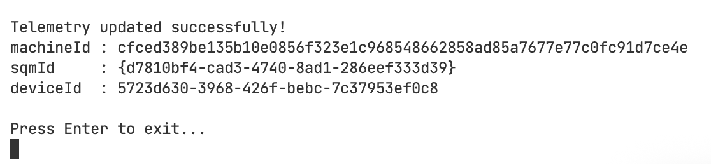

# update-telemetry-windsurf

## Windows
- Change `DevNHT Asus` in `$file = "C:\Users\DevNHT Asus\AppData\Roaming\Windsurf\User\globalStorage\storage.json"` (file .ps1)
- After run file .bat

## Mac
- Change `nht` in `FILE="/Users/nht/Library/Application Support/Windsurf/User/globalStorage/storage.json"` (file .sh)
- Save and run file .sh

## Ubuntu
- You can only:
- - 🔧 Install WindSurf IDE automatically via script
- - 🧹 Remove it completely with all related files
- > Run the `wds-setup.sh` script and select option 1 to install, or 2 to uninstall cleanly.
---

